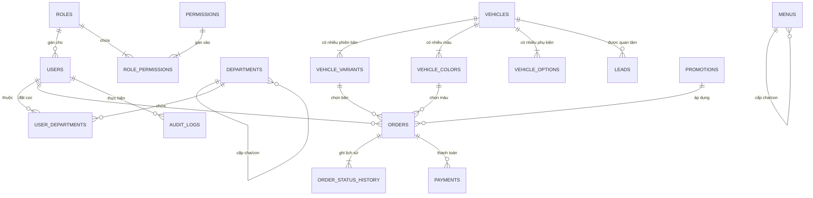

# Database ERD Design — Aduc Auto Backend

> **Database Engine**: PostgreSQL  
> **ORM**: SQLAlchemy 2.0 (Async) + Alembic Migration  
> **Nguyên tắc**: 16 Bảng dữ liệu được gom nhóm theo đúng ranh giới của từng Module.

---

## 1. Sơ Đồ ERD Tổng Thể (Mermaid Diagram)

---

## 2. Chi Tiết Các Bảng Theo Module

### 2.1 Module `users` (Quản trị Người dùng & Phân quyền)

#### 1. `users` (Tài khoản người dùng)
- `id` (UUID, Primary Key, Default: `uuid_generate_v4()`)
- `username` (VARCHAR(255), Unique, Not Null, Index)
- `password_hash` (VARCHAR(255), Not Null)
- `full_name` (VARCHAR(100), Not Null)
- `phone` (VARCHAR(20), Not Null)
- `is_active` (BOOLEAN, Default: `true`)
- `role_id` (UUID, Foreign Key `roles.id`, Not Null)
- `department_id` (UUID, Foreign Key `departments.id`, Nullable- vì tài khoản customer sẽ không có phòng ban)
- `created_at` (TIMESTAMPTZ, Default: `NOW()`)

#### 2. `roles` (Vai trò hệ thống)
- `id` (UUID, Primary Key)
- `name` (VARCHAR(50), Unique, Not Null) — ví dụ: `admin`, `sale`, `customer`
- `description` (TEXT, Nullable)

#### 3. `permissions` (Quyền chi tiết)
- `id` (UUID, Primary Key)
- `resource` (VARCHAR(50), Not Null) — ví dụ: `orders`, `catalog`, `users`
- `action` (VARCHAR(50), Not Null) — ví dụ: `read`, `create`, `update_status`, `delete`
- *Constraint*: `UNIQUE(resource, action)`

#### 4. `role_permissions` (Bảng trung gian Role - Permission)
- `role_id` (UUID, Foreign Key `roles.id`, Primary Key)
- `permission_id` (UUID, Foreign Key `permissions.id`, Primary Key)

#### 5. `departments` (Phòng ban / Showroom / Chi nhánh)
- `id` (UUID, Primary Key)
- `name` (VARCHAR(100), Not Null)
- `parent_id` (UUID, Foreign Key `departments.id`, Nullable) — Cấu trúc cây Showroom/Phòng ban

---

### 2.2 Module `catalog` (Danh mục Sản phẩm Xe)

#### 7. `vehicles` (Dòng xe ô tô)
- `id` (UUID, Primary Key)
- `name` (VARCHAR(100), Not Null) — ví dụ: `VF 8`, `VF 9`
- `slug` (VARCHAR(100), Unique, Not Null, Index)
- `base_price` (NUMERIC(15, 2), Not Null) — Giá niêm yết tham chiếu
- `deposit_amount` (NUMERIC(15, 2), Not Null) — Mức cọc mặc định
- `description` (TEXT, Nullable)
- `thumbnail_url` (VARCHAR(500), Nullable)
- `is_active` (BOOLEAN, Default: `true`)
- `created_at` (TIMESTAMPTZ, Default: `NOW()`)

#### 8. `vehicle_variants` (Phiên bản dòng xe)
- `id` (UUID, Primary Key)
- `vehicle_id` (UUID, Foreign Key `vehicles.id`, Not Null)
- `name` (VARCHAR(100), Not Null) — ví dụ: `Eco`, `Plus`, `Premium`
- `price` (NUMERIC(15, 2), Not Null)
- `deposit_amount` (NUMERIC(15, 2), Not Null)
- `spec_summary` (JSONB, Nullable) — Thông số kỹ thuật (Pin, công suất, tầm vận hành)
- `is_active` (BOOLEAN, Default: `true`)

#### 9. `vehicle_colors` (Tùy chọn màu sắc ngoại thất)
- `id` (UUID, Primary Key)
- `vehicle_id` (UUID, Foreign Key `vehicles.id`, Not Null)
- `name` (VARCHAR(50), Not Null) — ví dụ: `Trắng Brahmaputra`, `Đen VinFast`
- `hex_code` (VARCHAR(10), Nullable) — Mã màu HEX UI
- `image_url` (VARCHAR(500), Not Null) — Ảnh xe phối màu tương ứng
- `price_extra` (NUMERIC(15, 2), Default: `0`) — Phụ thu màu đặc biệt

#### 10. `vehicle_options` (Trang bị phụ kiện chọn thêm)
- `id` (UUID, Primary Key)
- `vehicle_id` (UUID, Foreign Key `vehicles.id`, Not Null)
- `name` (VARCHAR(100), Not Null)
- `description` (TEXT, Nullable)
- `price` (NUMERIC(15, 2), Not Null)

---

### 2.3 Module `leads` (Yêu cầu Tư vấn & Đăng ký Lái thử)

#### 11. `leads` (Thông tin Lead)
- `id` (UUID, Primary Key)
- `vehicle_id` (UUID, Foreign Key `vehicles.id`, Not Null)
- `customer_name` (VARCHAR(100), Not Null)
- `phone` (VARCHAR(20), Not Null, Index)
- `email` (VARCHAR(255), Nullable)
- `showroom_pref` (VARCHAR(200), Nullable) — Showroom mong muốn lái thử
- `status` (VARCHAR(30), Default: `'new'`) — `new`, `contacted`, `test_driven`, `cancelled`
- `notes` (TEXT, Nullable)
- `created_at` (TIMESTAMPTZ, Default: `NOW()`)

---

### 2.4 Module `orders` (Quản lý Đơn đặt cọc & State Machine)

#### 12. `orders` (Đơn đặt cọc)
- `id` (UUID, Primary Key)
- `order_code` (VARCHAR(32), Unique, Not Null, Index) — Ví dụ: `ORD-20260729-A1B2C3`
- `user_id` (UUID, Foreign Key `users.id`, Not Null)
- `variant_id` (UUID, Foreign Key `vehicle_variants.id`, Not Null)
- `color_id` (UUID, Foreign Key `vehicle_colors.id`, Not Null)
- `deposit_amount` (NUMERIC(15, 2), Not Null)
- `status` (VARCHAR(20), Default: `'pending'`, Index) — `pending`, `paid`, `confirmed`, `cancelled`, `refunded`
- `customer_name` (VARCHAR(100), Not Null)
- `phone` (VARCHAR(20), Not Null)
- `email` (VARCHAR(255), Not Null)
- `id_card` (VARCHAR(20), Not Null) — Số CCCD / CMND
- `created_at` (TIMESTAMPTZ, Default: `NOW()`)

#### 13. `order_status_history` (Lịch sử chuyển đổi trạng thái đơn)
- `id` (UUID, Primary Key)
- `order_id` (UUID, Foreign Key `orders.id`, Not Null)
- `from_status` (VARCHAR(20), Nullable)
- `to_status` (VARCHAR(20), Not Null)
- `changed_by` (UUID, Foreign Key `users.id`, Nullable) — Null nếu do System/Webhook thực hiện
- `changed_at` (TIMESTAMPTZ, Default: `NOW()`)
- `note` (TEXT, Nullable)

#### 14. `promotions` (Mã giảm giá / Ưu đãi cọc)
- `id` (UUID, Primary Key)
- `code` (VARCHAR(50), Unique, Not Null)
- `discount_type` (VARCHAR(20), Not Null) — `fixed_amount`, `percentage`
- `discount_value` (NUMERIC(15, 2), Not Null)
- `valid_from` (TIMESTAMPTZ, Not Null)
- `valid_to` (TIMESTAMPTZ, Not Null)

---

### 2.5 Module `payments` (Giao dịch Thanh toán Sandbox/Cổng thanh toán)

#### 15. `payments` (Lịch sử thanh toán)
- `id` (UUID, Primary Key)
- `order_id` (UUID, Foreign Key `orders.id`, Not Null)
- `transaction_code` (VARCHAR(100), Unique, Nullable, Index) — Mã giao dịch từ VNPay/MoMo (Phục vụ Idempotency)
- `amount` (NUMERIC(15, 2), Not Null)
- `status` (VARCHAR(20), Default: `'pending'`) — `pending`, `success`, `failed`
- `gateway` (VARCHAR(30), Not Null) — `vnpay`, `momo`
- `raw_webhook_payload` (JSONB, Nullable) — Lưu toàn bộ payload IPN/Webhook để Audit
- `paid_at` (TIMESTAMPTZ, Nullable)

---

### 2.6 Core Infrastructure (Cross-cutting Concerns)

#### 16. `audit_logs` (Nhật ký thao tác hệ thống)
- `id` (UUID, Primary Key)
- `user_id` (UUID, Foreign Key `users.id`, Nullable)
- `action` (VARCHAR(100), Not Null) — Ví dụ: `order.status_changed`, `catalog.vehicle_created`
- `resource` (VARCHAR(50), Not Null)
- `resource_id` (UUID, Nullable)
- `payload` (JSONB, Nullable)
- `ip_address` (VARCHAR(45), Nullable)
- `created_at` (TIMESTAMPTZ, Default: `NOW()`)

#### 17. `menus` (Cấu hình Menu động theo Permission)
- `id` (UUID, Primary Key)
- `label` (VARCHAR(100), Not Null)
- `path` (VARCHAR(200), Not Null)
- `icon` (VARCHAR(50), Nullable)
- `parent_id` (UUID, Foreign Key `menus.id`, Nullable)
- `required_permission` (VARCHAR(100), Nullable) — Ví dụ: `orders:read`
- `sort_order` (INT, Default: `0`)
