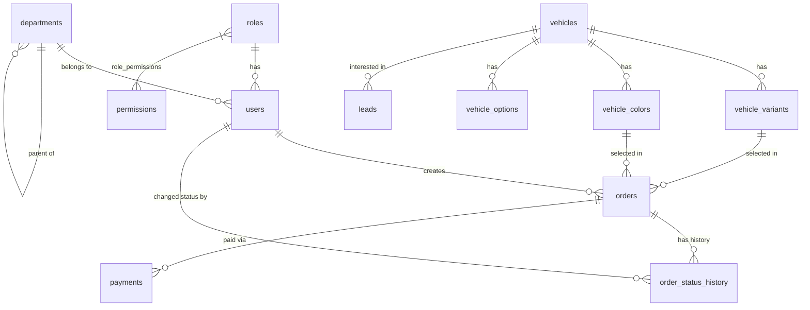

# Sơ Đồ Thực Thể Liên Kết (ERD) - Backend Aduc-Auto

Dưới đây là sơ đồ ERD tổng quan cho tất cả các model thuộc 5 modules: **Users**, **Catalog**, **Leads**, **Orders**, và **Payments**.

---

## Chi tiết Các Module và Bảng

### 1. Users Module (Quản lý người dùng & Phân quyền)
- **`users`**: Tài khoản người dùng (Nhân viên, Khách hàng, Admin)
  - `id` (PK, UUID)
  - `email`, `username`, `password_hash`, `full_name`, `phone`, `is_active`
  - `role_id` (FK -> `roles.id`)
  - `department_id` (FK -> `departments.id`)
- **`roles`**: Vai trò trong hệ thống (e.g. Sales, Manager, Admin)
  - `id` (PK, UUID), `name`, `description`
- **`permissions`**: Quyền hạn chi tiết đối với từng tài nguyên
  - `id` (PK, UUID), `resource`, `action`
- **`role_permissions`**: Bảng trung gian n-n giữa Roles & Permissions
  - `role_id` (FK), `permission_id` (FK)
- **`departments`**: Phòng ban / Chi nhánh showroom (Có hỗ trợ cấp cha-con)
  - `id` (PK, UUID), `name`, `parent_id` (FK -> `departments.id`)

### 2. Catalog Module (Danh mục sản phẩm xe)
- **`vehicles`**: Dòng xe chính
  - `id` (PK, UUID), `name`, `slug`, `category`, `base_price`, `is_active`
- **`vehicle_variants`**: Phiên bản / Trim xe
  - `id` (PK, UUID), `vehicle_id` (FK -> `vehicles.id`), `name`, `sku`, `price`, `specs`
- **`vehicle_colors`**: Tùy chọn màu sắc
  - `id` (PK, UUID), `vehicle_id` (FK -> `vehicles.id`), `name`, `color_code`, `price_extra`
- **`vehicle_options`**: Tùy chọn thiết bị / Phụ kiện đi kèm
  - `id` (PK, UUID), `vehicle_id` (FK -> `vehicles.id`), `name`, `price`

### 3. Leads Module (Quản lý khách hàng tiềm năng / Đăng ký lái thử)
- **`leads`**: Yêu cầu tư vấn / Lái thử xe
  - `id` (PK, UUID)
  - `vehicle_id` (FK -> `vehicles.id`)
  - `customer_name`, `phone`, `email`, `showroom_pref`, `status`

### 4. Orders Module (Đơn đặt cọc xe)
- **`orders`**: Thông tin đơn đặt cọc
  - `id` (PK, UUID), `order_code` (Mã đơn hàng)
  - `user_id` (FK -> `users.id`, nullable)
  - `variant_id` (FK -> `vehicle_variants.id`)
  - `color_id` (FK -> `vehicle_colors.id`)
  - `deposit_amount`, `status`, `customer_name`, `phone`, `email`, `id_card`
- **`order_status_history`**: Lịch sử chuyển trạng thái đơn hàng
  - `id` (PK, UUID)
  - `order_id` (FK -> `orders.id`)
  - `from_status`, `to_status`, `changed_by` (FK -> `users.id`), `note`

### 5. Payments Module (Thanh toán giao dịch)
- **`payments`**: Giao dịch cọc tiền
  - `id` (PK, UUID)
  - `order_id` (FK -> `orders.id`)
  - `payment_method`, `amount`, `status`, `transaction_code`, `payment_url`, `paid_at`

---

## Mermaid ERD Diagram (Dạng Code Interative)

