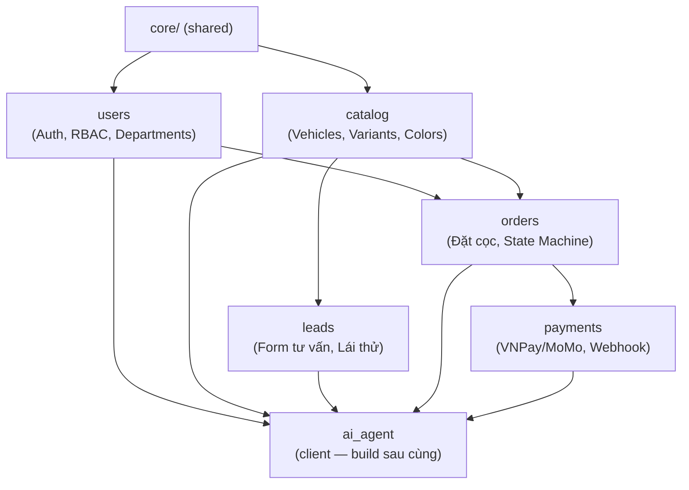

# Deliverables — Giai Đoạn 1 & 2

> Mỗi deliverable = 1 file cụ thể cần tạo ra + tiêu chí "done" rõ ràng.
> Kiến trúc: **Modular 3-Layer Monolith** (module theo nghiệp vụ, mỗi module giữ 3-layer bên trong).

---

## GIAI ĐOẠN 1 — System Design & Architecture

**Mục tiêu**: Tất cả quyết định kiến trúc được viết thành văn bản, được xem xét kỹ trước khi viết dòng code đầu tiên ở Giai đoạn 2.

**Tuần thực hiện**: Tuần 1 (đồng hành với Giai đoạn 0 — PRD đã có sẵn).

---

### D1.1 — Module Dependency Map

**File**: `docs/module-dependency.md`

**Nội dung cần có**:

```
Sơ đồ phụ thuộc (dạng text + Mermaid diagram):

users, catalog     →  module nền tảng, không phụ thuộc module nghiệp vụ khác
leads              →  phụ thuộc catalog
orders             →  phụ thuộc catalog + users
payments           →  phụ thuộc orders
ai_agent           →  client của tất cả — không module nào được import ngược lại

2 quy tắc code cứng:
1. Gọi module khác → chỉ qua B/service.py, KHÔNG import B/repository.py hay B/model.py
2. Cross-cutting (audit, notification) → đặt ở core/, không nhét vào module cụ thể
```

**Mermaid diagram cần vẽ**:


**Tiêu chí done**:
- [ ] File được tạo tại `docs/module-dependency.md`
- [ ] Mermaid diagram render đúng trong GitHub
- [ ] 2 quy tắc code được phát biểu rõ bằng chữ (không chỉ diagram)
- [ ] Liệt kê rõ **cái gì KHÔNG được làm** (ví dụ: payments không tự UPDATE bảng orders)

---

### D1.2 — ERD Database Design

**File**: `docs/erd-design.md` (bổ sung vào `docs/architecture-erd-design.md` hiện có)

**Bảng cần thiết kế, nhóm theo module**:

| Module | Bảng | Ghi chú |
|--------|------|---------|
| **users** | `users` | id, email, password_hash, full_name, phone, is_active, created_at |
| | `roles` | id, name (admin, sale, customer), description |
| | `permissions` | id, resource, action — UNIQUE(resource, action) |
| | `role_permissions` | role_id FK, permission_id FK |
| | `departments` | id, name, parent_id (self-ref) |
| **catalog** | `vehicles` | id, name, slug (UK), base_price, deposit_amount, is_active |
| | `vehicle_variants` | id, vehicle_id FK, name, price, deposit_amount, spec_summary JSONB |
| | `vehicle_colors` | id, vehicle_id FK, name, hex_code, image_url, price_extra |
| | `vehicle_options` | id, vehicle_id FK, name, price |
| **leads** | `leads` | id, vehicle_id FK, customer_name, phone, email, showroom_pref, status, notes, created_at |
| **orders** | `orders` | id, order_code (UK), user_id FK, variant_id FK, color_id FK, deposit_amount, status, customer_name, phone, id_card |
| | `order_status_history` | id, order_id FK, from_status, to_status, changed_by FK, changed_at, note |
| | `promotions` | id, code (UK), discount_type, discount_value, valid_from, valid_to |
| **payments** | `payments` | id, order_id FK, transaction_code (UK), amount, status, gateway, raw_webhook_payload JSONB, paid_at |
| **core (cross-cutting)** | `audit_logs` | id, user_id FK, action, resource, resource_id, payload JSONB, ip_address, created_at |
| | `menus` | id, label, path, icon, parent_id (self-ref), required_permission, sort_order |

**Tiêu chí done**:
- [ ] Tất cả bảng liệt kê đủ cột, kiểu dữ liệu, FK relationships
- [ ] Mermaid ERD diagram render đúng
- [ ] `order_status_history` có đủ để audit trail (ai đổi, bao giờ, từ đâu sang đâu)
- [ ] `audit_logs` đủ để trace mọi thao tác admin
- [ ] `transaction_code` trên `payments` có UNIQUE constraint (phục vụ idempotency)

---

### D1.3 — API Contract Specification

**File**: `docs/api-contract.md`

**Response format chuẩn** (áp dụng toàn bộ API):
```json
// Success
{"success": true, "data": {...}, "meta": {"page": 1, "total": 50}}

// Error
{"success": false, "error": {"code": "NOT_FOUND", "message": "Đơn hàng không tồn tại"}}
```

**Endpoint cần thiết kế**:

#### Public (không cần JWT)
| Method | Path | Ghi chú |
|--------|------|---------|
| GET | `/api/v1/catalog/vehicles` | Phân trang: `?page=1&limit=12` |
| GET | `/api/v1/catalog/vehicles/{slug}` | Kèm variants + colors |
| POST | `/api/v1/auth/register` | Body: email, password, full_name, phone |
| POST | `/api/v1/auth/login` | → access_token + refresh_token |
| POST | `/api/v1/auth/refresh` | Body: refresh_token → access_token mới |
| POST | `/api/v1/leads` | Form tư vấn/lái thử |
| POST | `/api/v1/payments/webhook` | Public — VNPay callback (verify HMAC) |

#### Customer (JWT required)
| Method | Path | Ghi chú |
|--------|------|---------|
| GET | `/api/v1/auth/me` | Thông tin user hiện tại |
| POST | `/api/v1/orders` | Tạo đơn đặt cọc |
| GET | `/api/v1/orders/{order_code}` | Xem đơn (chỉ đơn của mình) |
| POST | `/api/v1/payments/{order_id}/init` | Khởi tạo URL thanh toán |

#### Admin (JWT + specific permission)
| Method | Path | Permission cần |
|--------|------|----------------|
| GET | `/api/v1/admin/orders` | `orders:read` |
| PATCH | `/api/v1/admin/orders/{id}/status` | `orders:update_status` |
| POST | `/api/v1/admin/catalog/vehicles` | `catalog:create` |
| PUT | `/api/v1/admin/catalog/vehicles/{id}` | `catalog:update` |
| DELETE | `/api/v1/admin/catalog/vehicles/{id}` | `catalog:delete` |
| GET | `/api/v1/admin/leads` | `leads:read` |
| PATCH | `/api/v1/admin/leads/{id}/status` | `leads:update` |
| GET/POST | `/api/v1/admin/users/roles` | `roles:manage` |
| GET | `/api/v1/admin/users/departments` | `users:manage` |
| GET | `/api/v1/admin/audit-logs` | `audit_logs:read` |
| GET | `/api/v1/admin/menus` | (theo role JWT) |

**Tiêu chí done**:
- [ ] Tất cả endpoint có đủ: method, path, auth, request schema, response schema
- [ ] Response format chuẩn được định nghĩa và áp dụng nhất quán
- [ ] State machine `orders` được mô tả rõ (5 trạng thái, valid transitions)
- [ ] Webhook endpoint có ghi chú: "luôn trả 200, verify HMAC trước"

---

### D1.4 — RBAC Permission Matrix

**File**: `docs/rbac-matrix.md`

| Permission | Admin | Sale | Customer | Guest |
|------------|:-----:|:----:|:--------:|:-----:|
| `catalog:read` | ✅ | ✅ | ✅ | ✅ |
| `catalog:create` | ✅ | ❌ | ❌ | ❌ |
| `catalog:update` | ✅ | ❌ | ❌ | ❌ |
| `catalog:delete` | ✅ | ❌ | ❌ | ❌ |
| `orders:read_own` | ✅ | ✅ | ✅ | ❌ |
| `orders:read_all` | ✅ | ✅ | ❌ | ❌ |
| `orders:update_status` | ✅ | ✅ | ❌ | ❌ |
| `orders:cancel` | ✅ | ❌ | ❌ | ❌ |
| `leads:read` | ✅ | ✅ | ❌ | ❌ |
| `leads:update` | ✅ | ✅ | ❌ | ❌ |
| `users:manage` | ✅ | ❌ | ❌ | ❌ |
| `roles:manage` | ✅ | ❌ | ❌ | ❌ |
| `audit_logs:read` | ✅ | ❌ | ❌ | ❌ |

**Tiêu chí done**:
- [ ] Bảng matrix đầy đủ không bỏ sót permission
- [ ] `check_permission(user, "resource:action")` được mô tả là hàm implement ở `users/service.py`
- [ ] Cơ chế department ghi rõ: Sale chỉ xem đơn của showroom mình

---

### D1.5 — Project Skeleton (Tạo Cây Thư Mục)

**Mục tiêu**: Toàn bộ cây thư mục + placeholder files được tạo thực sự trên filesystem.

```
aduc-auto/
├── pyproject.toml                    # uv workspace root
├── .env.example
│
├── backend/
│   ├── pyproject.toml
│   ├── alembic.ini
│   ├── alembic/
│   │   ├── env.py                    # import ALL models
│   │   └── versions/
│   └── src/app/
│       ├── main.py
│       ├── config.py
│       ├── core/
│       │   ├── database.py
│       │   ├── security.py
│       │   ├── dependencies.py
│       │   ├── middlewares.py
│       │   ├── exceptions.py
│       │   ├── audit.py
│       │   └── response.py
│       └── modules/
│           ├── users/        → model.py, repository.py, service.py, schema.py, api.py
│           ├── catalog/      → model.py, repository.py, service.py, schema.py, api.py
│           ├── leads/        → model.py, repository.py, service.py, schema.py, api.py
│           ├── orders/       → model.py, repository.py, service.py, schema.py, api.py
│           └── payments/
│               ├── model.py, repository.py, service.py, schema.py, api.py
│               └── gateways/vnpay.py
│
├── tests/
│   ├── conftest.py
│   ├── unit/   → test_users_service.py, test_orders_service.py, test_payments_service.py
│   └── integration/ → test_auth_api.py, test_orders_api.py, test_payments_webhook.py
│
├── frontend/   (Giai đoạn 3)
├── infra/      (Giai đoạn 5)
└── docs/
    ├── prd.md                        ✅ done
    ├── module-dependency.md          D1.1
    ├── erd-design.md                 D1.2
    ├── api-contract.md               D1.3
    └── rbac-matrix.md                D1.4
```

**Tiêu chí done**:
- [ ] Toàn bộ thư mục + file placeholder tạo trên filesystem
- [ ] Mỗi Python file có docstring module mô tả mục đích
- [ ] `alembic/env.py` có placeholder import cho tất cả models

---

### ✅ Review Gate — Giai Đoạn 1 Hoàn Thành Khi:

- [ ] D1.1 `docs/module-dependency.md` — diagram + 2 quy tắc code cứng
- [ ] D1.2 `docs/erd-design.md` — 16 bảng đầy đủ, ERD diagram
- [ ] D1.3 `docs/api-contract.md` — ~22 endpoint, response format chuẩn
- [ ] D1.4 `docs/rbac-matrix.md` — permission matrix theo role
- [ ] D1.5 Cây thư mục tạo đủ trên filesystem
- [ ] **Review gate**: mọi câu hỏi "tại sao A gọi B" đều có câu trả lời trong D1.1 → mới chuyển sang Giai đoạn 2

---
---

## GIAI ĐOẠN 2 — Backend Development (Modular 3-Layer)

**Mục tiêu**: Backend đầy đủ 5 module, có auth, RBAC, audit trail, state machine, payment webhook idempotent.

**Tuần thực hiện**: Tuần 2–5. Thứ tự build: module nền tảng trước, module phụ thuộc sau.

---

### D2.0 — Core Layer (Tuần 2, làm đầu tiên)

| File | Implement |
|------|-----------|
| `config.py` | `AppSettings`: DATABASE_URL, SECRET_KEY, ACCESS_TOKEN_EXP=4h, REFRESH_TOKEN_EXP=7d, VNPAY_*, MAIL_* |
| `core/database.py` | `Base`, `async_engine`, `AsyncSessionLocal`, `get_db()` (yield + auto-commit/rollback) |
| `core/security.py` | `hash_password()`, `verify_password()`, `create_access_token()`, `create_refresh_token()`, `decode_token()` |
| `core/exceptions.py` | `AppError(HTTPException)`, `NotFoundError(404)`, `ConflictError(409)`, `ForbiddenError(403)`, `UnauthorizedError(401)` |
| `core/response.py` | `success(data, meta?)`, `error(code, message)` — format chuẩn áp dụng toàn API |
| `core/middlewares.py` | CORS, request-id header, rate limit cơ bản |
| `core/audit.py` | `log(session, user_id, action, resource, resource_id, payload)` — INSERT cùng transaction |
| `core/dependencies.py` | `get_current_user(token)`, `check_permission(resource, action) → Depends` |
| `main.py` | FastAPI factory, `lifespan()`, mount routers, register exception handlers |

**Tiêu chí done**:
- [ ] `get_db()` auto-commit nếu thành công, auto-rollback nếu exception
- [ ] `check_permission("orders", "update_status")` dùng được ở bất kỳ router nào
- [ ] `audit.log()` nhận `session` — INSERT cùng transaction, không bao giờ fail main operation
- [ ] Response format chuẩn nhất quán 100% API

---

### D2.1 — Module `users` (Tuần 2)

**Module đầu tiên — mọi module khác cần auth.**

**`model.py`** — 6 models:

| Model | Cột chính |
|-------|-----------|
| `UserModel` | id(UUID), email(UK,idx), password_hash, full_name, phone, is_active, role_id FK, created_at |
| `RoleModel` | id, name(UK), description |
| `PermissionModel` | id, resource, action, UNIQUE(resource, action) |
| `RolePermission` | role_id FK, permission_id FK (association table) |
| `DepartmentModel` | id, name, parent_id (self-ref nullable) |
| `UserDepartment` | user_id FK, department_id FK |

**`service.py`** — public interface:
```python
register(session, email, password, full_name, phone) → UserModel
  # raise ConflictError nếu email tồn tại, hash password trước khi INSERT

login(session, email, password) → tuple[access_token, refresh_token]
  # raise UnauthorizedError (email/pass sai), login throttle check

check_permission(session, user_id, resource, action) → bool
  # lookup user.role → permissions → check "resource:action"

refresh_token(session, refresh_token_str) → str  # new access_token
get_departments(session) → list[DepartmentModel]
```

**`api.py`** — endpoints:
```
POST /api/v1/auth/register
POST /api/v1/auth/login
POST /api/v1/auth/refresh
GET  /api/v1/auth/me
GET  /api/v1/admin/users
GET  /api/v1/admin/users/departments
GET/POST /api/v1/admin/users/roles
```

**Tiêu chí done**:
- [ ] Auth flow hoạt động: register → login → access token → refresh
- [ ] JWT access 4h, refresh 7d, `UserResponse` KHÔNG có `password_hash`
- [ ] Login throttle: 5 lần sai/phút → 429
- [ ] `check_permission()` Depends: thiếu quyền → 403
- [ ] Unit test: register trùng email (409), sai password (401), check_permission đúng/sai

---

### D2.2 — `core/audit.py` (Tuần 2, ngay sau D2.1)

```python
async def log(
    session: AsyncSession,
    user_id: UUID | None,      # None cho system action (webhook)
    action: str,               # "order.status_changed", "payment.confirmed"
    resource: str,             # "orders", "payments"
    resource_id: UUID | None,
    payload: dict | None = None,
    ip_address: str | None = None,
) -> None
```

**Tiêu chí done**:
- [ ] Nhận `session` — INSERT cùng transaction với thao tác chính
- [ ] Dùng try/except nội bộ — log lỗi nhưng KHÔNG fail main operation
- [ ] `payload` serialize safe (loại bỏ field nhạy cảm)

---

### D2.3 — Module `catalog` (Tuần 3)

**Module nền tảng #2 — `service.py` phải có public interface cho `orders` dùng.**

**`model.py`** — 4 models: `VehicleModel`, `VariantModel`, `ColorModel`, `OptionModel`

**`service.py`** — public interface (quan trọng cho inter-module):
```python
list_vehicles(session, page, limit) → list[VehicleModel]
get_by_slug(session, slug) → VehicleModel           # raise NotFoundError nếu None
get_variant(session, variant_id) → VariantModel     # ← orders/service sẽ gọi hàm này
get_color(session, color_id) → ColorModel           # ← orders/service sẽ gọi hàm này
admin_create_vehicle(session, user_id, **data) → VehicleModel
  # gọi audit.log(session, user_id, "catalog.vehicle_created", ...)
admin_update_vehicle(session, user_id, vehicle_id, **data) → VehicleModel
```

**Tiêu chí done**:
- [ ] `GET /catalog/vehicles/{slug}` eager load variants + colors — 1 query (selectinload)
- [ ] `get_variant()` và `get_color()` là public method, được gọi bởi `orders/service`
- [ ] Admin CRUD vehicle cần `catalog:create/update/delete`
- [ ] Unit test: `get_by_slug` không có → NotFoundError

---

### D2.4 — Module `leads` (Tuần 4)

**Phụ thuộc `catalog/service`.**

**`service.py`**:
```python
submit_lead(session, vehicle_id, customer_name, phone, email, showroom_pref) → LeadModel
  # 1. catalog.service.get_by_id(vehicle_id)  ← gọi qua service, KHÔNG import catalog/model
  # 2. INSERT LeadModel(status="new")
  # 3. background: workers.email.send_lead_notification()

list_leads(session, status_filter, page, limit) → list[LeadModel]
update_lead_status(session, user_id, lead_id, new_status) → LeadModel
  # gọi audit.log(...)
```

**Tiêu chí done**:
- [ ] `POST /leads` public endpoint, rate limit 10 req/min/IP
- [ ] `leads/service.py` KHÔNG import gì từ `catalog/repository.py` hoặc `catalog/model.py`
- [ ] Email notification gửi background (không block response)

---

### D2.5 — Module `orders` (Tuần 4) — Phức tạp nhất

**Phụ thuộc `catalog/service` + `users/service`.**

**State Machine** (định nghĩa trong `service.py`):
```python
VALID_TRANSITIONS = {
    "pending":   ["paid", "cancelled"],
    "paid":      ["confirmed", "refunded"],
    "confirmed": [],    # terminal
    "cancelled": [],    # terminal
    "refunded":  [],    # terminal
}
```

**`model.py`** — 2 models:
- `OrderModel`: id, order_code(UK,idx), user_id FK, variant_id FK, color_id FK, deposit_amount, status, customer_name, phone, email, id_card
- `OrderStatusHistory`: id, order_id FK, from_status, to_status, changed_by FK (nullable), changed_at, note

**`service.py`**:
```python
create(session, user_id, variant_id, color_id, customer_name, phone, email, id_card) → OrderModel
  # 1. catalog.service.get_variant(variant_id) → lấy deposit_amount
  # 2. catalog.service.get_color(color_id) → validate thuộc cùng xe
  # 3. order_code = f"ORD-{date}-{uuid4().hex[:6].upper()}"
  # 4. INSERT OrderModel(status="pending")
  # 5. INSERT OrderStatusHistory(from=None, to="pending")
  # 6. audit.log(session, user_id, "order.created", "orders", order.id)

get_by_code(session, order_code, user_id=None) → OrderModel
  # user_id truyền vào → validate order.user_id == user_id

update_status(session, order_id, new_status, changed_by=None, note=None) → OrderModel
  # 1. validate VALID_TRANSITIONS → raise AppError(409) nếu sai
  # 2. UPDATE order.status
  # 3. INSERT OrderStatusHistory
  # 4. audit.log(...)
```

**Tiêu chí done**:
- [ ] State machine reject tất cả transition sai → 409 với message rõ ràng
- [ ] Mỗi thay đổi status → record trong `order_status_history` + `audit_logs`
- [ ] Customer GET đơn chỉ xem được của mình
- [ ] Admin `PATCH /admin/orders/{id}/status` cần `orders:update_status`
- [ ] **Unit test đầy đủ**: test TẤT CẢ transition hợp lệ VÀ không hợp lệ

---

### D2.6 — Module `payments` (Tuần 5) — Dễ bug nhất

**Phụ thuộc `orders/service`.**

**`gateways/vnpay.py`**:
```python
build_payment_url(order, payment, return_url) → str
  # Sort params, HMAC-SHA512, return VNPay redirect URL

verify_signature(raw_payload, secret) → bool
  # Extract vnp_SecureHash, recalculate, so sánh bằng hmac.compare_digest (constant-time)
```

**`service.py`** — Idempotency flow (4 bước theo đúng thứ tự):
```python
handle_webhook(session, raw_payload, background_tasks) → None

  # Bước 1: Verify signature
  if not vnpay.verify_signature(raw_payload):
      return  # log warning, RETURN — không raise, không trả 400

  txn_code = raw_payload["vnp_TransactionNo"]

  # Bước 2: Idempotency check
  existing = query payment WHERE transaction_code=txn_code AND status="success"
  if existing:
      return  # RETURN ngay — đã xử lý rồi

  # Bước 3: Update payment (cùng session với bước 4 → atomic)
  payment.status = "success"
  payment.transaction_code = txn_code
  payment.paid_at = now()

  # Bước 4: Update order (gọi qua orders/service — KHÔNG tự sửa bảng orders)
  await orders.service.update_status(session, order.id, "paid",
                                     note="VNPay webhook confirmed")

  # Bước 5: Background — gửi email (không block commit)
  background_tasks.add_task(workers.email.send_order_confirmation, order.id)

  # get_db() commit payment + order cùng lúc sau khi handler return
```

**`api.py`**:
```
POST /api/v1/payments/{order_id}/init  [JWT]  → trả {"payment_url": "...", "order_code": "..."}
POST /api/v1/payments/webhook          [PUBLIC] → LUÔN trả 200, {"RspCode":"00"}
```

**Tiêu chí done**:
- [ ] HMAC verify đúng theo VNPay spec, dùng `hmac.compare_digest`
- [ ] Webhook idempotency: gọi 2 lần cùng `transaction_code` → chỉ update 1 lần
- [ ] `payment + order` update trong cùng 1 DB transaction
- [ ] Webhook LUÔN trả 200 (kể cả khi signature sai)
- [ ] **Unit test idempotency**: mock repo, gọi 2 lần → INSERT chỉ được gọi 1 lần
- [ ] **Integration test**: full webhook flow end-to-end

---

### D2.7 — Workers / Background Tasks (Tuần 5)

**`workers/email.py`**:
```python
async def send_order_confirmation(order_id: UUID) → None
  # Tạo session RIÊNG (background task không dùng request session)

async def send_lead_notification(lead_id: UUID) → None
```

**Tiêu chí done**:
- [ ] Fail email = log error, KHÔNG rollback order (background-safe)
- [ ] Test được với MailHog (local) và SMTP thật (production)

---

### D2.8 — Tests & Swagger (Song song với từng module)

**Không dồn về cuối — viết ngay sau khi hoàn thành từng module.**

| Module | Unit test | Integration test |
|--------|-----------|-----------------|
| users | register/login/check_permission | POST /auth/*, GET /auth/me |
| catalog | list/get_by_slug | GET /catalog/vehicles/* |
| leads | submit_lead (validate vehicle_id) | POST /leads |
| orders | **state machine đầy đủ** | POST /orders, PATCH status |
| payments | **idempotency** (2 lần) | POST /payments/webhook |

**Swagger**:
- [ ] `GET /docs` hiển thị tất cả endpoint
- [ ] Mỗi endpoint có mô tả + request/response schema
- [ ] Error responses (401, 403, 404, 409, 422) được document

---

### ✅ Review Gate — Giai Đoạn 2 Hoàn Thành Khi:

#### Core
- [ ] `get_db()` auto-commit/rollback đúng
- [ ] Response format chuẩn nhất quán 100%
- [ ] `check_permission()` Depends hoạt động

#### Auth
- [ ] Register → Login → Access → Refresh đủ flow
- [ ] JWT không chứa password hash
- [ ] Login throttle 5/phút hoạt động

#### Catalog + Leads
- [ ] Public API phân trang đúng
- [ ] `get_variant()`, `get_color()` public interface hoạt động

#### Orders
- [ ] State machine reject tất cả transition sai
- [ ] `order_status_history` + `audit_logs` ghi đầy đủ

#### Payments
- [ ] Idempotency: gọi webhook 2 lần → chỉ xử lý 1 lần (**integration test pass**)
- [ ] Payment + Order commit trong 1 transaction

#### Quality Gates (không thể bỏ qua)
- [ ] `grep -r "from app.modules.catalog.repository" app/modules/orders/` → **0 kết quả**
- [ ] `grep -r "from app.modules.orders.repository" app/modules/payments/` → **0 kết quả**
- [ ] `alembic upgrade head` chạy sạch
- [ ] Tất cả unit test + integration test pass
- [ ] `GET /docs` Swagger UI đầy đủ

---

## Tóm Tắt Deliverables

| # | Giai đoạn | Deliverable | Output | Tuần |
|---|-----------|-------------|--------|------|
| D1.1 | 1 | Module Dependency Map | `docs/module-dependency.md` | 1 |
| D1.2 | 1 | ERD Database Design | `docs/erd-design.md` | 1 |
| D1.3 | 1 | API Contract Specification | `docs/api-contract.md` | 1 |
| D1.4 | 1 | RBAC Permission Matrix | `docs/rbac-matrix.md` | 1 |
| D1.5 | 1 | Project Skeleton | Filesystem (folders + placeholders) | 1 |
| D2.0 | 2 | Core Layer | `app/core/*` + `main.py` | 2 |
| D2.1 | 2 | Module users | `app/modules/users/*` | 2 |
| D2.2 | 2 | core/audit.py | `app/core/audit.py` | 2 |
| D2.3 | 2 | Module catalog | `app/modules/catalog/*` | 3 |
| D2.4 | 2 | Module leads | `app/modules/leads/*` | 4 |
| D2.5 | 2 | Module orders | `app/modules/orders/*` | 4 |
| D2.6 | 2 | Module payments | `app/modules/payments/*` | 5 |
| D2.7 | 2 | Workers | `app/workers/*` | 5 |
| D2.8 | 2 | Tests & Swagger | `tests/*` | Song song |
