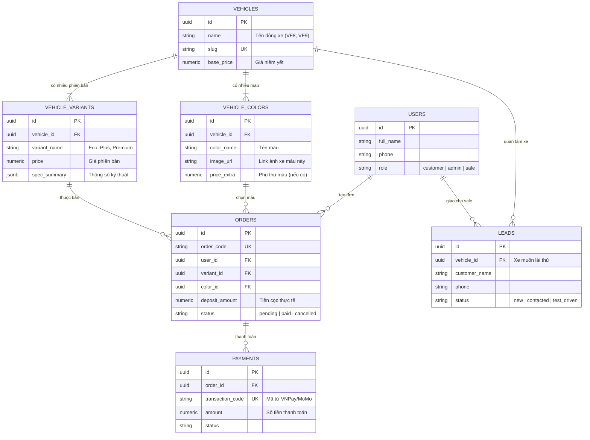

# System Architecture & Database Design (ERD) — Car Deposit Platform

> **Tài liệu**: Kiến trúc hệ thống, Sơ đồ cơ sở dữ liệu (ERD) & API Specification  
> **Giai đoạn**: Giai đoạn 1 (System Design & Architecture)  
> **Ngày cập nhật**: 28/07/2026  

---

## 1. Kiến Trúc Tổng Thể (System Architecture)

Hệ thống được thiết kế theo mô hình **Monolith phân lớp (Layered Monolith)** rõ ràng để đảm bảo tính đơn giản khi phát triển nhưng dễ dàng mở rộng thành Microservices sau này.

```
car-booking-platform/
├── backend/                  # FastAPI Monolith
│   ├── app/
│   │   ├── core/             # Configuration, Database session, Security (JWT/Password), Exception Handlers
│   │   ├── models/           # SQLAlchemy DB Models (ORM)
│   │   ├── schemas/          # Pydantic Schemas (Request/Response DTOs)
│   │   ├── repositories/     # Data Access Layer (CRUD Database operations)
│   │   ├── services/         # Business Logic Layer (Order state machine, Payment processing)
│   │   ├── api/              # API Endpoints (v1 Router)
│   │   └── main.py           # Application entry point
│   ├── alembic/              # Database Migration scripts
│   ├── tests/                # Pytest suits (Unit & Integration tests)
│   └── pyproject.toml / uv.lock
├── frontend/                 # Next.js App Router (TypeScript + TailwindCSS + shadcn/ui)
├── infra/                    # Docker, Docker-compose, Nginx configuration
└── docs/                     # PRD, ERD, API specs
```

---

## 2. Thiết Kế Database (ERD Diagram & Schemas)

Sử dụng **PostgreSQL**. Dưới đây là Mermaid Diagram thể hiện chi tiết mối quan hệ giữa các bảng:



---

## 3. API Contract Specification (RESTful API v1)

### Public Endpoints (Khách hàng & SEO)
- `GET /api/v1/vehicles` — Lấy danh sách mẫu xe (hỗ trợ phân trang, filter theo category)
- `GET /api/v1/vehicles/{slug}` — Lấy chi tiết mẫu xe kèm danh sách `variants` và `colors`
- `POST /api/v1/leads` — Đăng ký tư vấn / Đặt lịch lái thử xe

### Authentication Endpoints
- `POST /api/v1/auth/register` — Đăng ký tài khoản khách hàng
- `POST /api/v1/auth/login` — Đăng nhập (Trả về JWT Access Token & Refresh Token)
- `POST /api/v1/auth/refresh` — Làm mới Access Token
- `GET /api/v1/auth/me` — Lấy thông tin người dùng đang đăng nhập

### Order & Payment Endpoints (Luồng đặt cọc)
- `POST /api/v1/orders` — Tạo đơn đặt cọc mới (Trạng thái ban đầu: `pending`)
- `GET /api/v1/orders/{order_code}` — Tra cứu chi tiết đơn hàng theo mã đơn
- `POST /api/v1/orders/{order_code}/payment` — Tạo URL thanh toán (VNPay/MoMo Sandbox)
- `POST /api/v1/webhooks/payment/{gateway}` — Callback nhận IPN/Webhook từ cổng thanh toán (Xử lý Idempotent)

### Admin Endpoints (Yêu cầu JWT Token + Role `admin`)
- `GET /api/v1/admin/orders` — Lấy danh sách đơn hàng (Filter theo status, ngày tạo)
- `PATCH /api/v1/admin/orders/{id}/status` — Cập nhật trạng thái đơn hàng (Duyệt cọc, huỷ cọc)
- `POST /api/v1/admin/vehicles` — Thêm mới xe vào catalog
- `PUT /api/v1/admin/vehicles/{id}` — Cập nhật thông tin xe/giá cọc/màu sắc
- `GET /api/v1/admin/leads` — Xem danh sách Lead đăng ký tư vấn
