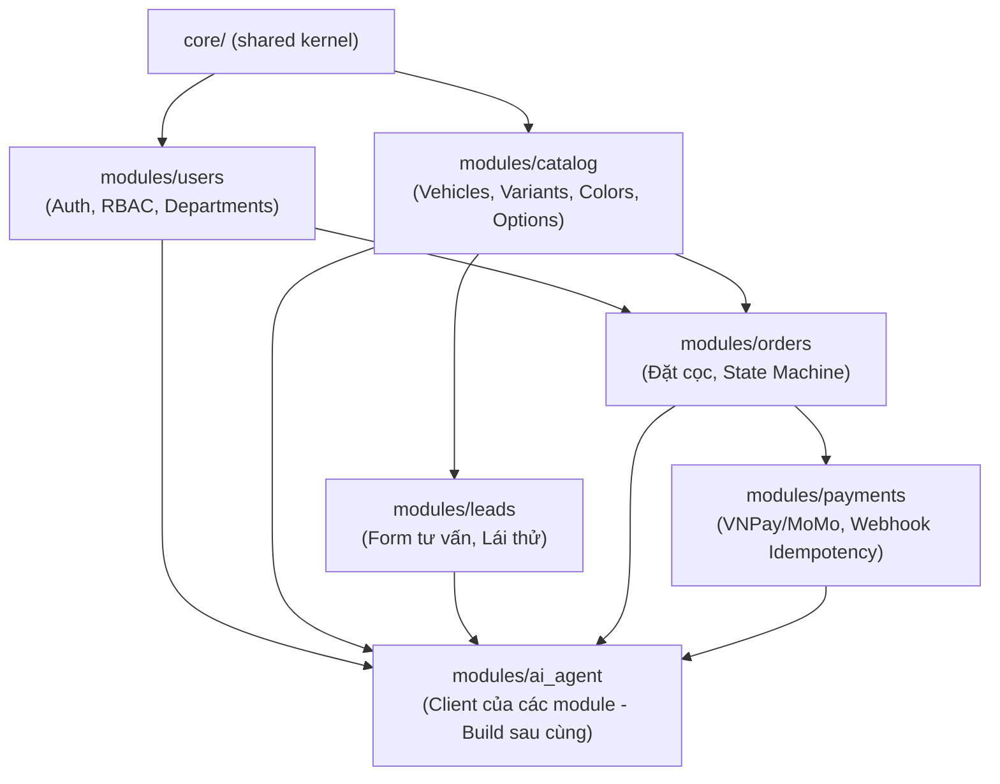

# Module Dependency Map — Aduc Auto Backend

> **Kiến trúc**: Modular 3-Layer Monolith  
> **Nguyên tắc**: Module độc lập theo domain nghiệp vụ. Giao tiếp liên module chỉ thông qua Public Service Interface.

---

## 1. Sơ Đồ Phụ Thuộc Giữa Các Module

---

## 2. Chi Tiết Phụ Thuộc Giữa Các Module

| Module | Phụ thuộc vào các module | Mục đích phụ thuộc |
|---|---|---|
| `core/` | Không | Shared Infrastructure (DB config, Exception, Security, Audit, Response Format) |
| `users` | `core/` | Module nền tảng cho Auth, User Profile, Roles, Permissions, Departments |
| `catalog` | `core/` | Module nền tảng cho Catalog xe, Phiên bản, Màu sắc, Phụ kiện |
| `leads` | `core/`, `catalog` | Cần validate thông tin xe mà khách quan tâm qua `catalog.service` |
| `orders` | `core/`, `users`, `catalog` | Cần `users.service` (xác thực khách) và `catalog.service` (validate variant, color, lấy deposit_amount) |
| `payments` | `core/`, `orders` | Cần `orders.service` để kiểm tra trạng thái đơn và cập nhật đơn cọc sang `paid` khi webhook thành công |
| `ai_agent` | `core/`, tất cả các module | Đóng vai trò Client gọi vào `service.py` của các module để phục vụ hội thoại AI |

---

## 3. Hai Quy Tắc Code Cứng (Rules of Engagement)

### Quy tắc 1: Inter-module Communication qua Service Interface
- Module A muốn sử dụng dữ liệu hoặc nghiệp vụ của Module B **BẮT BUỘC** phải gọi thông qua `modules/B/service.py` (Public Service Interface).
- **TUYỆT ĐỐI KHÔNG**:
  - Import trực tiếp `modules/B/model.py` hoặc `modules/B/repository.py` từ Module A.
  - Tự ý thực hiện SQL Query/Join trực tiếp sang bảng của Module B trong `repository.py` của Module A.

### Quy tắc 2: Core là nơi chứa Cross-cutting Concerns
- Các tính năng dùng chung như Audit Trail (`audit_service`), Logging, Error Handling, Response Format, JWT Token Utilities phải đặt tại `app/core/`.
- Không nhét tính năng dùng chung vào một module nghiệp vụ cụ thể để tránh tình trạng circular dependency (phụ thuộc vòng).

---

## 4. Những Thao Tác Bị Cấm (Forbidden Direct Access)

- ❌ `payments` **KHÔNG ĐƯỢC** tự `UPDATE orders SET status = 'paid'` trực tiếp trong DB. Phải gọi `orders_service.update_status(session, order_id, 'paid')`.
- ❌ `orders` **KHÔNG ĐƯỢC** import `catalog.model.VehicleVariantModel` để truy vấn trực tiếp. Phải gọi `catalog_service.get_variant(session, variant_id)`.
- ❌ Không module nghiệp vụ nào được phép import ngược lại `modules/ai_agent`.
